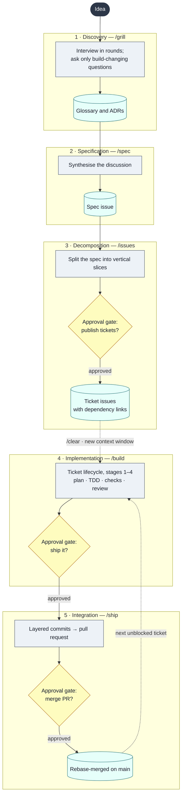
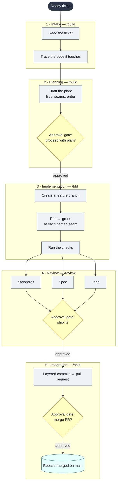

# dotagents

My agent setup — skills, hooks and rules — kept in one repo and linked into every harness I use. Project-agnostic: nothing here assumes a particular codebase.

```
python install.py
```

Safe to re-run. It links, never copies, so editing a file here changes it everywhere at once:

| Path | Harness |
|---|---|
| `~/.claude/skills/<name>` → `skills/<name>` | Claude Code |
| `~/.agents/skills/<name>` → `skills/<name>` | Codex and other [Agent Skills](https://agentskills.io) harnesses |
| `~/.claude/hooks` → `hooks/`, wiring from `harness/claude/hooks.json` merged into `~/.claude/settings.json` (backed up first) | Claude Code |
| `~/.claude/CLAUDE.md` (`@`-imports `AGENTS.md`), `~/.codex/AGENTS.md` → `AGENTS.md` | Claude Code, Codex |

Anything already at one of those paths that isn't a link here is left alone and reported. On Windows, directory links are junctions (no admin); the one file link needs Developer Mode.

## Layout

- `AGENTS.md` — rules every harness should follow.
- `skills/` — one folder per skill, `SKILL.md` in the open Agent Skills format.
- `hooks/` — Python hooks, JSON on stdin, exit code out. Each looks for skills in the project's `.claude/` first, then `~/.claude/`. Test: `python hooks/test_tap_approval.py`.
- `harness/<name>/` — the wiring one harness needs. Adding a harness = a folder here and a few lines in `install.py`.

## Why this exists

These are my skills, built from a mix of [Matt Pocock's skills](https://github.com/mattpocock/skills) and [Ponytail](https://github.com/DietrichGebert/ponytail). The point is to control what context each agent gets, instead of dragging one long conversation from idea to merge:

- **One job per context window.** Planning (`grill` → `spec` → `issues`) stays in one window. Every ticket gets a fresh one (`/clear`, then `/build`). Anything that crosses a machine, harness or person goes through `/handoff`.
- **Handoffs are artifacts, not memory.** The spec and the tickets are GitHub issues. Terms go in `docs/glossary.md` and decisions in `docs/adr/`. The next agent reads those, not a transcript.
- **Sub-agents for scoped work.** `/review` runs three in parallel (standards, spec, lean) and reports them side by side, never merged into one verdict.
- **Best practice is built in, not remembered:** questions before code, vertical slices, TDD at the seams the ticket names, a three-axis review, layered commits that each pass the checks, rebase merges, and the simplest thing that works (`lazy`, always on).
- **You stay in the loop.** Every stop is a tappable question (Go? / Ship it? / Merge?), and hooks make sure the model can't skip one.

## How to use it

Work moves through two lifecycles. The **delivery lifecycle** takes an idea to merged code. Its implementation stage runs the **ticket lifecycle** once for every ticket. The two diagrams use the same notation:

| Shape | Meaning |
|---|---|
| Rounded box | Entry point |
| Rectangle | Step the agent performs |
| Diamond | Approval gate: a question only you can answer |
| Cylinder | Artifact the step produces; the next stage reads it |

### Delivery lifecycle: idea → merged code



| Stage | Command | Input | Output | Your role |
|---|---|---|---|---|
| 1 · Discovery | `/grill` | An idea, plan or decision | A settled design tree. Questions that don't change the build are defaulted and listed under **Assumed**. Terms go in `docs/glossary.md`, hard-to-reverse choices in `docs/adr/`. | Answer the questions |
| 2 · Specification | `/spec` | The discovery conversation | One GitHub issue: Problem · Solution · Slices · Decisions · Seams under test · Assumed · Not building | Start it |
| 3 · Decomposition | `/issues <spec #>` | The spec issue | One ticket per vertical slice, blockers first, with native dependency links | Approve publishing |
| 4 · Implementation | `/clear`, then `/build <ticket #>` | One ready ticket, in a fresh context | A tested, reviewed change on a feature branch | Approve the plan and the ship |
| 5 · Integration | `/ship` | The reviewed branch | Layered commits, a PR, a rebase merge, and the tickets it unblocks | Approve the merge |

Stages 1–3 share one context window. Every ticket in stage 4 starts a new one, so the agent works from the ticket and the repo, not from the planning transcript.

### Ticket lifecycle: one ticket → merged code



| Stage | Command | Input | Output | Your role |
|---|---|---|---|---|
| 1 · Intake | `/build <ticket #>` | The ticket issue | A trace of the code the ticket touches | Start it |
| 2 · Planning | `/build` | The ticket and the trace | A plan: files to change, seams to test, order of work | Approve or redirect |
| 3 · Implementation | `/tdd` | The approved plan | A feature branch, a failing test then passing code at each seam, checks passing | None |
| 4 · Review | `/review` | The diff since the base | Three independent reports (Standards, Spec, Lean) shown side by side, never merged into one | Approve the ship |
| 5 · Integration | `/ship` | The reviewed branch | Commits that each pass the checks, a PR, a rebase merge, the branch deleted, and what's next | Approve the merge |

Hooks enforce the gates; the model can't skip them. `no-commit-on-default.py` refuses commits and pushes on `main`, so stage 3 always runs on a branch. `tap-approval.py` refuses to start `/ship` unless you just tapped **Ship it**. The merge gate is part of `/ship` itself: an open PR is never taken as permission.

### Detours

```mermaid
flowchart TD
    classDef terminal fill:#2d3748,stroke:#2d3748,color:#ffffff
    classDef step fill:#edf2f7,stroke:#4a5568,color:#1a202c

    subgraph D1["Design question — /prototype"]
        D1i(["Question only running code can answer"]):::terminal
        D1a["Throwaway prototype<br/>on a prototype/ branch"]:::step
        D1b["Answer returns to /grill"]:::step
        D1i --> D1a --> D1b
    end

    subgraph D2["Defect — /diagnose"]
        D2i(["Something is broken or slow"]):::terminal
        D2a["Build a failing feedback loop<br/>before any theory"]:::step
        D2b["Structural findings go to /arch"]:::step
        D2i --> D2a --> D2b
    end

    subgraph D3["Codebase health — /arch"]
        D3i(["A spare moment"]):::terminal
        D3a["Report up to 5<br/>deepening candidates"]:::step
        D3b["/grill the chosen candidate"]:::step
        D3i --> D3a --> D3b
    end

    subgraph D4["Change of context — /handoff"]
        D4i(["New directory, harness or person"]):::terminal
        D4a["Write a handoff document"]:::step
        D4b["Next session starts from it"]:::step
        D4i --> D4a --> D4b
    end
```



### At a phase boundary

The first one that fits wins:

1. **Continue**: the next phase needs this one word for word.
2. **`/clear`**: nothing here matters next.
3. **`/handoff`**: moving to a new directory, harness, or person.
4. **Sub-agent**: tightly scoped work that doesn't need steering.
5. **`/compact <what's next>`**: the default, and the last resort.

## Examples

**A new feature, end to end**

```
/grill I want users to export their data as CSV
   → questions in rounds; defaults listed under "Assumed"
/spec
   → issue #12: Problem · Solution · Slices · Seams under test · Not building
/issues 12
   → #13 export one table, #14 export all (blocked by #13), #15 download UI (blocked by #14)
/clear
/build 13
   → plan → Go? → feat/13-export-table → red → green → review → Ship it?
   → [tap] → PR #16 → Merge? → [tap] → merged; "#14 is unblocked"
/clear
/build 14
```

**A small fix that doesn't need a spec**

```
(ticket #20 already exists and is clear)
/build 20
```

**A bug**

```
/diagnose checkout total is off by one cent on some carts
   → builds a failing repro first, then theories, then the fix
/review main
/ship
```

**A design question that needs running code**

```
/grill should drafts autosave or save on blur?
   → "this needs a prototype"
/prototype
   → throwaway UI on prototype/autosave; you click through it
   → the answer goes back into the grill
```

**Keeping the codebase healthy**

```
/arch    → HTML report of up to 5 deepening candidates, then a grill on the one you pick
/audit   → ranked list of what to delete or replace with stdlib/native
/debt    → every `# lazy:` shortcut, its ceiling, and its upgrade trigger
```

**Reviewing work in progress or a branch**

```
/review main        → since main
/review HEAD~3      → the last three commits
```

**Handing off to another machine or harness**

```
/handoff continue slice #14 in Codex
   → a handoff doc in the OS temp dir; the new session starts from it
```

**Adjusting how lazy it is**

```
/lazy ultra   → push hard for less code
/lazy lite    → nudge only
/lazy off
```

## Reserved for you

`/spec`, `/issues`, `/build`, `/arch`, `/handoff`, `/debt`, `/audit` and `/guide` run only when you type them. `/ship` runs when you type it or tap **Ship it**. The model can't start them on its own (`tap-approval.py`), and can't read their `SKILL.md` to replay them by hand (`reserved-skills.py`). Commits and pushes on `main` are blocked (`no-commit-on-default.py`).

## Skills

The idea → ship chain: `grill` → `spec` → `issues` → `build` (`tdd`, `review`) → `ship`. `guide` maps it on one screen.

- `arch` — find deepening opportunities, report the top candidates, grill the one you pick
- `audit` — whole-repo hunt for over-engineering, ranked
- `build` — build one ticket: trace, plan, branch, TDD, check, review, then offer to ship
- `debt` — harvest `lazy:` shortcut comments into one ledger
- `deep-modules` — shared vocabulary for designing deep modules
- `diagnose` — loop for hard bugs and performance regressions
- `domain` — the project glossary (`docs/glossary.md`) and ADRs (`docs/adr/`)
- `grill` — interview until the build-changing questions are settled
- `guide` — which skill fits, in what order
- `handoff` — compact a conversation into a handoff doc
- `issues` — split a spec into vertical-slice GitHub issues with dependency links
- `lazy` — the simplest solution that works; always on via the SessionStart hook
- `prototype` — throwaway prototype to answer a design question
- `review` — review since a fixed point: standards, spec, lean
- `ship` — layered commits → PR → merge; starts only on the user's say-so (`tap-approval.py`)
- `spec` — turn the conversation into a spec issue
- `tdd` — red → green at the ticket's seams
- `tickets` — impact analysis and dev-ready tickets in ClickUp

## Hooks

- `lazy-activate.py` — injects the `lazy` ruleset into every session and sub-agent; intensity from `.claude/lazy-mode`.
- `no-commit-on-default.py` — refuses `git commit`/`git push` on the default branch.
- `reserved-skills.py` — refuses to open the instructions of a user-only skill.
- `tap-approval.py` — lets a user's tap on a question start an `approval: tap` skill, and nothing else.

## Not here

Third-party skills, installed on their own: [agent-browser](https://github.com/vercel-labs/agent-browser), [Context7](https://github.com/upstash/context7).
